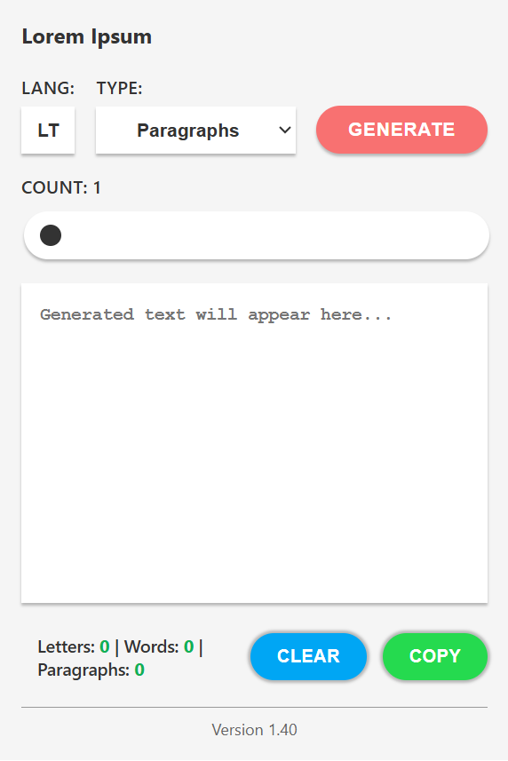

# Lorem Ipsum Generator — Edge Extension

A lightweight browser extension to generate Lorem Ipsum placeholder text directly from your toolbar.

## Features

- **Words, Paragraphs, or Letters** — three generation modes
- **Adjustable Count** — slider from 1 to 200
- **Real-time Counter** — live letters, words, and paragraphs stats
- **One-click Copy** — copy generated text to clipboard
- **Clear** — reset output instantly
- **Modern UI** — clean, minimal popup interface

## Installation

1. Clone or download this repository
2. Open Microsoft Edge and go to `edge://extensions/`
3. Enable **Developer mode** (toggle in bottom-left)
4. Click **Load unpacked** and select the extension folder

## Usage

1. Click the extension icon in the toolbar
2. Choose **Type**: Words, Paragraphs, or Letters
3. Adjust the **Count** slider (1–200)
4. Hit **Generate** to produce text
5. Check letters, words, and paragraph count at the bottom
6. Use **Copy** to copy or **Clear** to reset

## Files

| File | Purpose |
|---|---|
| `manifest.json` | Extension config (Manifest V3) |
| `popup.html` | Popup UI markup |
| `popup.js` | Generation logic and event handling |
| `style.css` | Popup styling |
| `icon16.png`, `icon48.png`, `icon128.png` | Extension icons |

## Version

**1.32**

## Browser Compatibility

- Microsoft Edge (Chromium-based)
- Any browser supporting Manifest V3

---

**Created:** 05/06/2026  
**Author:** Oleg Ushakov
